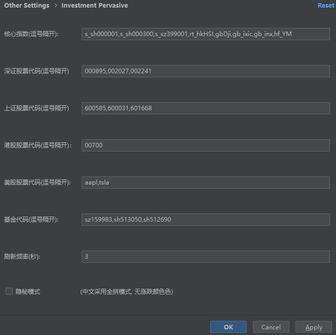
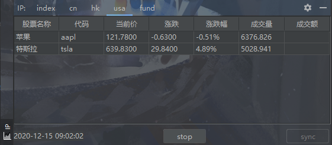
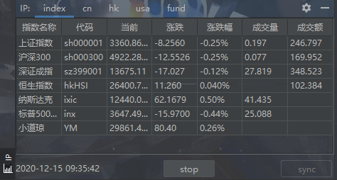
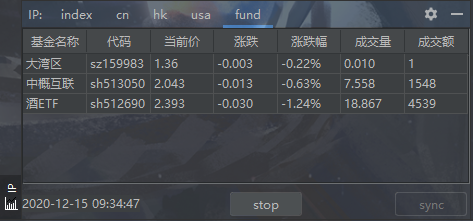

# investment-pervasive
IntelliJ IDEA平台插件: 查看股票实时行情. 支持美股, 港股, A股和基金.

# Installation
1. IntelliJ IDEA -> Preferences -> Plugins -> Install Plugin From Disk..., 
从github上下载本项目最新Releases文件->investment-pervasive-x.x.x.jar,文件并选中, 安装.

2. IntelliJ IDEA -> Preferences -> Plugins -> Marketplace, type (IP or investment-pervasive) to search and install.

# Compilation
在项目根目录打开 Terminal 窗口, 运行 ./gradlew build 或者 ./gradle buildPlugin命令, 结束后你会发现 build/libs/investment-pervasive-x.x.x.jar 文件的生成.

# Usage

设置完点击同步按钮sync开始从接口更新数据，stop按钮停止更新。
窗口收起或不展示则不会推送，多窗口如果都不展示则不会请求数据接口。

- Settings

- Stocks

- Indices

- Funds

# Changes

- 1.0.0
    - 根据设置窗口从新浪接口获取并展示核心指数，基金，美股，港股，A股数据
    
- 1.0.1
    - 添加事件日志，配置使用gradle publishPlugin task
    
- 1.0.2    
    - 修复数据展示细节错误,代码重构，根据Alibaba coding guidelines进行代码审查处理
